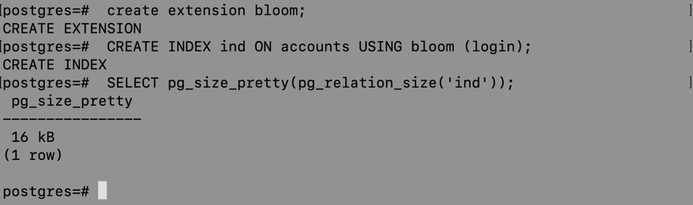
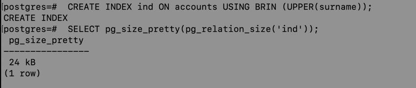
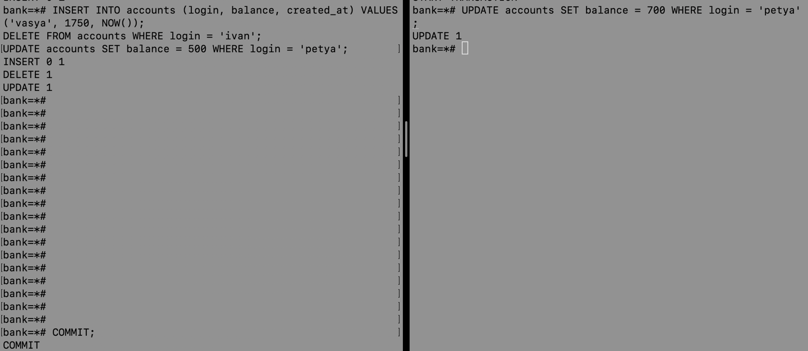

# Уровни изоляции

## Шаг 1: создание таблицы и заполнение её данными

Создание бд bank и подключение к ней:

Создание таблицу:

Наполнение её данными, как в статье:

## Шаг 2: Read uncommitted

- Запуск 2 параллельных транзакций. Выполнение `SELECT * FROM`.

  

- Выполнение `INSERT`, `DELETE`, `UPDATE` в одной транзакции. Выполнение `SELECT * FROM` в другой транзакции. Выполнение запрос `SUM(balance)`

  

- Выполнение `ROLLBACK` в первой транзакции. Выполнение `SELECT SUM(balance) FROM accounts` во второй транзакции

  

**Вывод**: вторая транзакция независима от первой транзакции, изменения не подтягиваются. В postgre отсутствует Read uncommitted 

## Шаг 3: Read committed

- Запуск 2 параллельных транзакций. Выполнение `SELECT * FROM`.

  

- Выполнение `INSERT`, `DELETE`, `UPDATE` в одной транзакции.

  

- Выполнение COMMIT в первой транзакции

  

**Вывод**: вторая транзакция видит только закомиченные изменения первой

## Шаг 4: Repeatable read

- Запуск 2 параллельных транзакций. Выполнить `SELECT * FROM`

  

- Выполнение `INSERT`, `DELETE`, `UPDATE` в одной транзакции. Выполнение `UPDATE` той же строки во второй транзакции

  

- Закоммитить изменения первой транзакции
  
  

- Выполнение `SELECT * FROM` во второй транзакции
  
    

**Вывод**: нельзя изменить данные в одной транзакции, не закоммитив изменения в другой

## Шаг 5: Serializable

- Запуск 2 параллельные транзакции. Выполнить `SELECT * FROM`.
  
  

- Выполнение `UPDATE`, `INSERT`, `DELETE` в первой транзакции. Выполнение `SELECT * FROM` в обеих транзакциях.

  (переименование Пети в Ивана) 

  

  (внесены ещё изменения)  

  

Вывод: каждая транзакция видит только свои изменения
