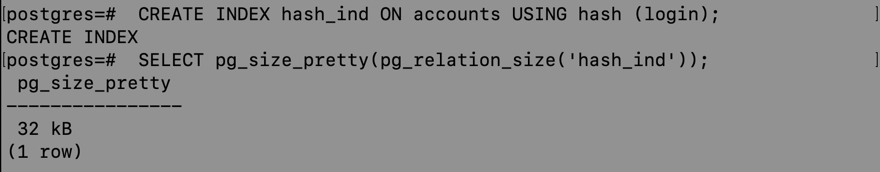
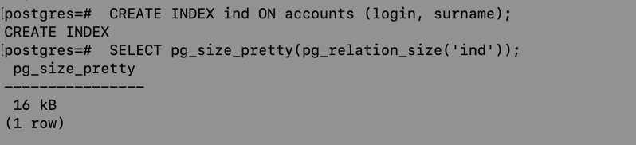
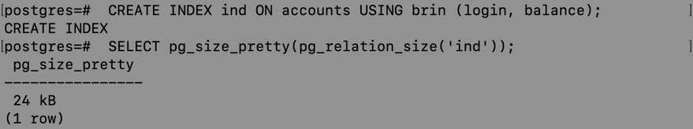
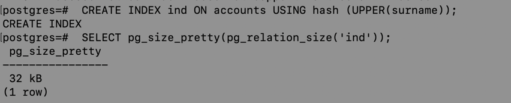
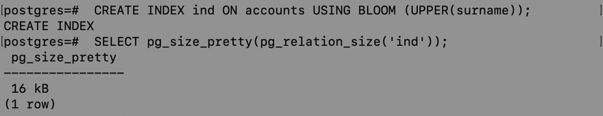

# Индексы

Создадим таблицу

```roomsql
CREATE DATABASE bank;

\c bank;

create table accounts
(
	id SERIAL
	primary key,
	login varchar(255) not null,
	balance bigint default 0 not null,
	surname varchar(255) not null,
);
```

Заполним данными

```roomsql
insert into accounts (login, balance, surname) values ('petya', 1000, 'Petrovich');
insert into accounts (login, balance, surname) values ('vasya', 2000, 'Vasyanovich');
insert into accounts (login, balance, surname) values ('mark', 500, 'Markovich');
```

## Создание индексов по колонке

btree индекс:

```roomsql
 CREATE INDEX btree_ind ON accounts (login);
```

Вычислим размер с помощью pg_size_pretty()

```roomsql
 SELECT pg_size_pretty(pg_relation_size('btree_ind'));
```

В качестве результата выводится таблица с размером  


Аналогично измеряем размер для остальных индексов:

  * hash индекс:  
  

  * bloom индекс:  
  необходимо создать соответствующий extention  
  

  * brin индекс:  
  

## Для двух колонок (для тех индексов, для которых это возможно):  
* btree индекс:  


* bloom индекс:  


* brin индекс:  


## Для выражения (для тех индексов, для которых это возможно):  

* btree индекс:  


* hash индекс:  


* bloom индекс:  


* brin индекс:  


**Вывод**: индексы имеют разный размер, самый маленький у btree и bloom индексов, самый большой - hash индекс

## Вывод формулы:

В Bloom-фильтре используются: массив бит длины m, k хеш-функций и несколько записей в количестве n.

Вероятность того, что ни одна хеш-функция не записала 1 в j-й бит: $(1 - \frac{1}{m})^k$

Вероятность того, что при одной вставке все хеш-функции запишут единицу во все биты:
$(1 - (1 - \frac{1}{m})^k)^k$

Вероятность коллизии при n вставках:
$(1 - (1 - \frac{1}{m})^{nk})^k$

**Результат**: $(1 - (1 - \frac{1}{32})^{2^{10}*32})^{32}$
